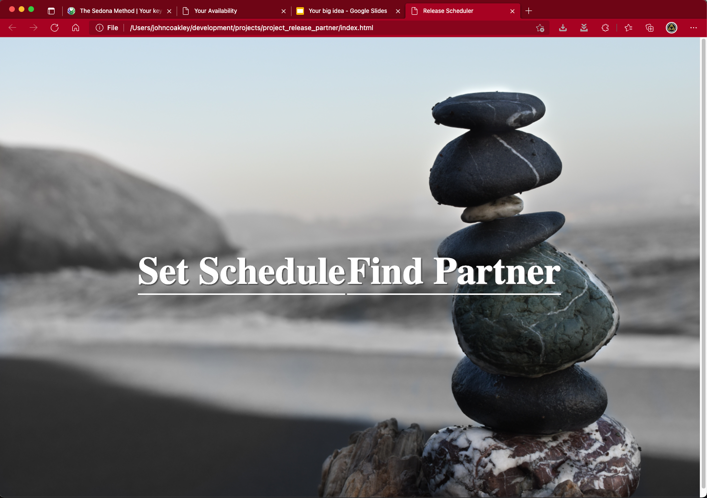
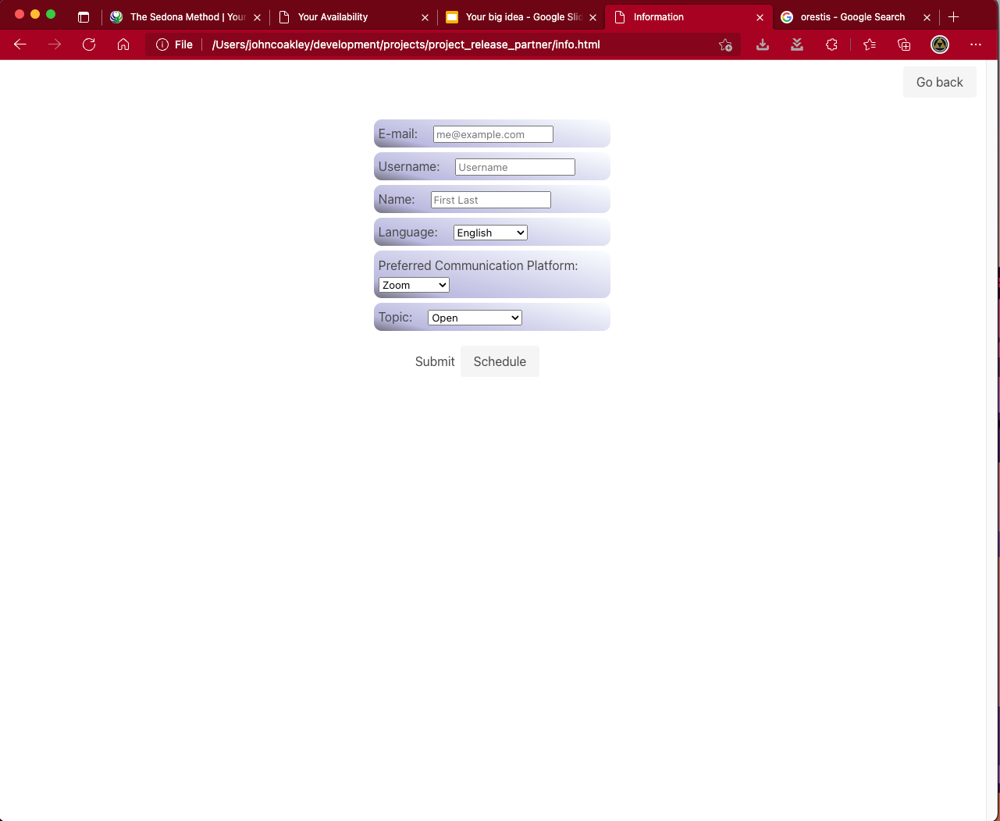
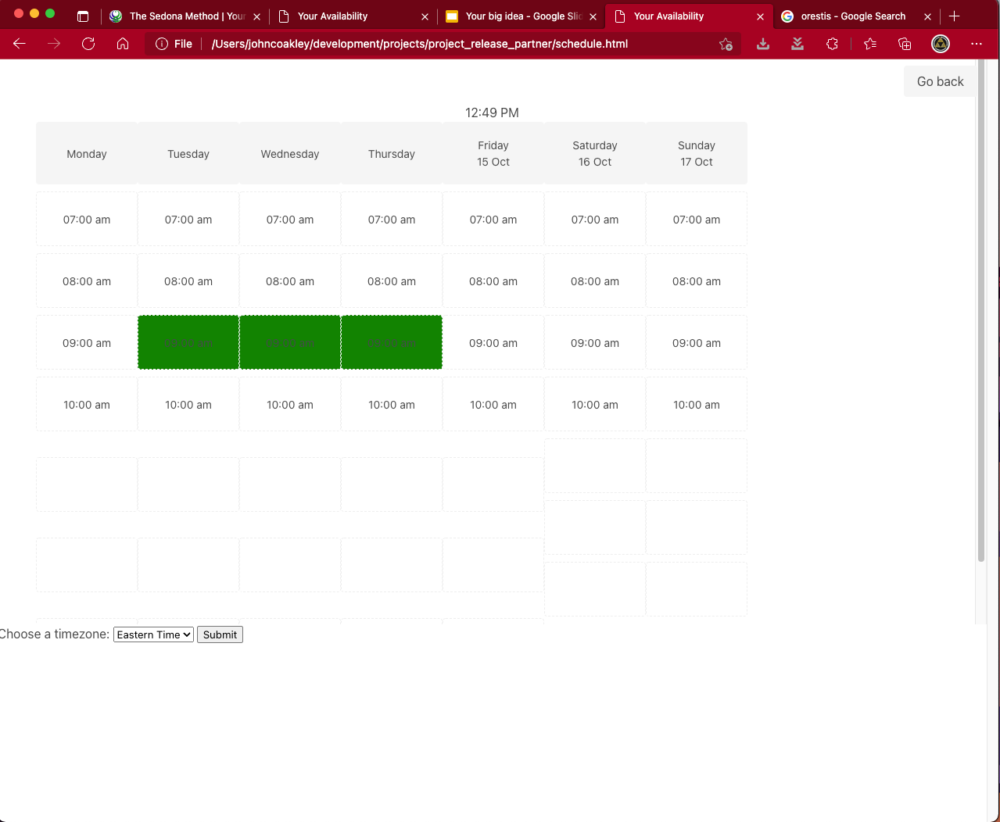
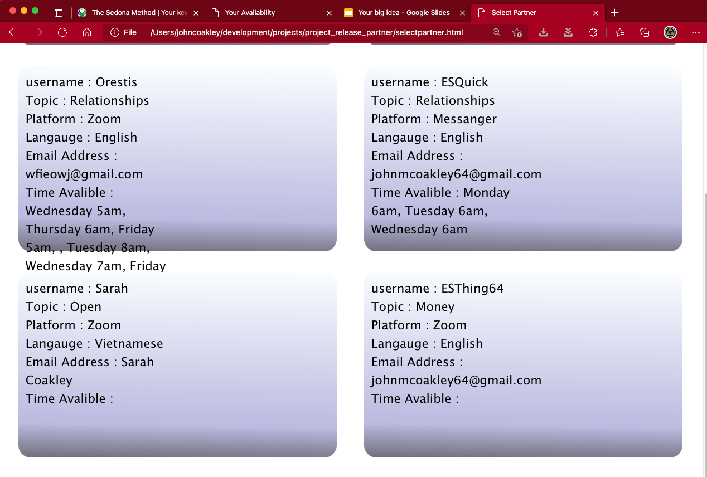

# project_release_partner

## What is this?

This is a tool to help you find a releasing partner in anytime zone. (the term releasing partner might not familiar to you if you have never used the Sedona Method.) The easiest way to explain this is making an analogy to meditation. While releasing isn’t meditation I find the end result to be very similar. A releasing partner will help guide you threw a "mediation" to help you with any area in your life that your are struggling with.   I highly suggest you visit https://www.sedona.com/Home.asp to learn more about this life changing process. 

# Why did I make this?
 This application was inspired by working with my amazing releasing partner who lives in Greece. Since I have started working with him my live has improved drastically in so many different areas. Managing the time difference is always a challenge.

I want this available to you. Yes, you the person reading this. This application, upon its completion will help you find a releasing partner who has the same free time as you. No matter where in the world you live, time differences won’t be a challenge.

# This is just the beginning
At this time, this application is only a DEMO of some of the features that are to come. Please see the future development section if you would like more information about the direction of this project. It is also to demonstrate our knowledge of working with APIs, local storage, JavaScript, and jQuery.

## Technologies Used

*JavaScript
*JQuery
*HTML
*CSS
*APIs: Unsplash & Luxon
*CSS framework: Bulma

## Link to project

https://esthing64.github.io/project_release_partner/

## How does it work?

# Set your schedule or find a partner
You the user will have an option to select weather you want to set your schedule or find a partner.

# Create a schedule
When you click the create a schedule button you will be presented with the entering your information as well as the time you are available. This info will be shown to other users who are looking for a partner. They will be presented with your available time as well as your desired topic for releasing. Along with the email address you would like them to contact you with. At this time when you save the time that you are available, only central time is currently supported. 

Step 1. Fill in your information and click the submit button. When clicking the submit button your info will be saved to local storage.

Step 2. Click on schedule. When you click on the time you are free it will change to green. (Undoing your selection is not available at this time.) Remember only central time is supported and that is displayed at the top of the calendar.

# Find a partner 

When you select this option, you will be presented with the different users who have decided to make their free time available to others. On this page you will see different users, their location and what that want to focus on when it comes to releasing. You can also see their free time. At this time when viewing the free time, it will be displayed in pacific time. Very soon there will be a feature added where you can toggle between central, pacific, and eastern.

## Known issues

This project is just a demo of what is to come. Everything is saved to local storage and has no application in the real world. This will change in future development.

only central time is supported when saving your schedule 

only pacific time is shown when viewing the time on the select partner page.

When clicking the submit button, there is no notification sent to the user. 

Website is not reponsive. Will only work on desktops at this time.

Needs a UI Overhaul.

There is no validation for the submit info form.

## Future development 

We will add the support of creating a log in for each user.

The time you create your schedule will be available in any time zone in the world. It will also allow you to choose any time you'd like. It won't just be limited to 7am - 10am.

When selecting a partner their schedule be shown in YOUR time zone. Or any other you choose to see it in.

# New features

# Darkmode

dark mode is on its way to the main branch soon! 

# Release NOW!
What if you had free time to release, but the partner isn't available at that time. Wouldn't it be nice to match up with another member of the community on the fly? You could set your status to stay. "I'm available to release now!" Other users on the platform could see that you are available and join you on the fly.

# Schedule manger

You found your partner already using the find a partner feature. You found out that you have similar free time. But uh oh! Life happened and you need to change your schedule a bit. This scheduler will allow you and your partner to setup the times for your feature sessions on the platform. Again, this feature will automatically translate the time into you local time zone. This schedule will only be visible between yourself and your partner. Its NOT for searching for a new partner. 

